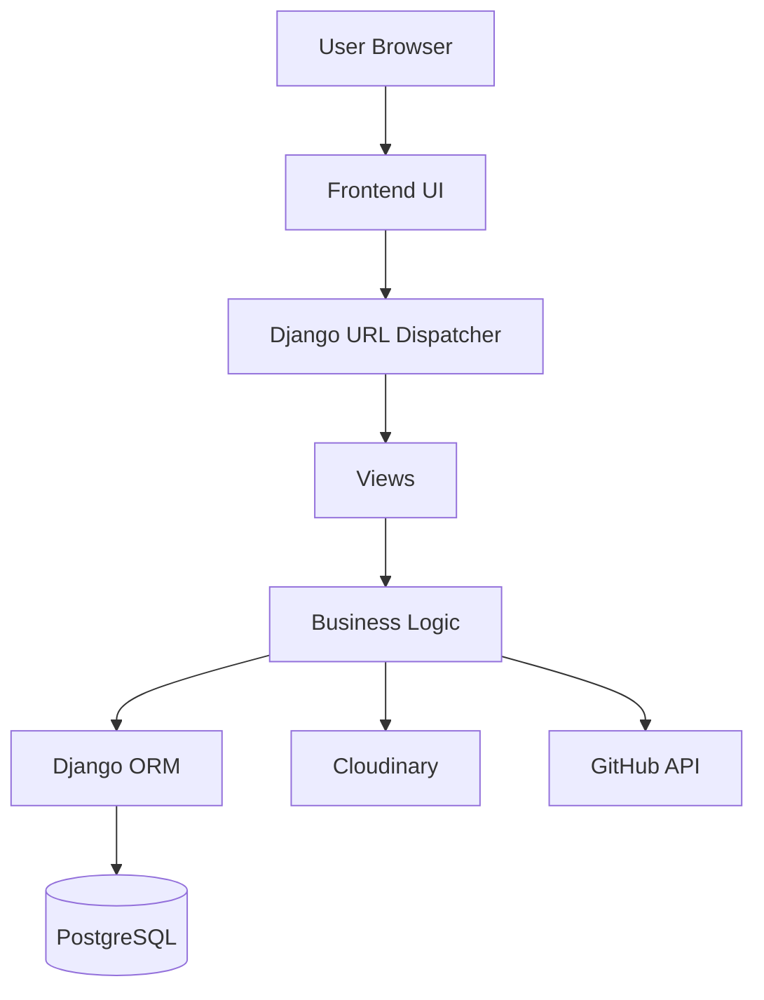
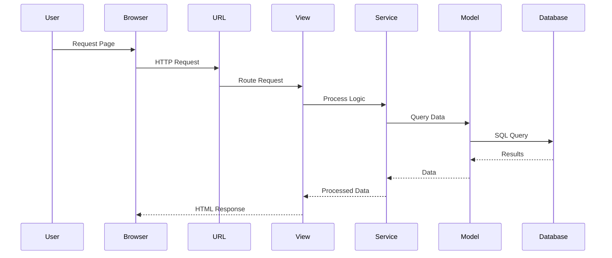

Dynamic Portfolio Website
Project Architecture Document
Project Name : Dynamic Portfolio Website
Version      : 1.0.0
Document Type: Software Architecture Document (SAD)
Framework    : Django
Database     : PostgreSQL
Author       : Mahammad Sinan
Status       : Planning Phase
1. Introduction
Overview

The Dynamic Portfolio Website follows a modular, scalable, and maintainable software architecture designed using Django's Model-Template-View (MTV) pattern. The architecture separates presentation, business logic, and data management to improve maintainability, testability, and future scalability.

The application is designed as a production-ready web platform with multiple independent modules such as Portfolio, Blog, Contact, Dashboard, Analytics, and REST APIs. Each module is developed as a reusable Django application to ensure loose coupling and high cohesion.

The architecture also supports responsive frontend development, secure authentication, cloud deployment, RESTful services, and future integration with mobile applications and external platforms.

2. Architecture Goals

The architecture is designed to achieve the following goals:

Modular and reusable codebase.
Clean separation of responsibilities.
High maintainability.
Easy scalability for future features.
Secure application design.
Responsive user experience.
Efficient database communication.
REST API support.
Cloud deployment readiness.
Simple administration and content management.
3. Architectural Principles

The project follows modern software engineering principles:

Separation of Concerns (SoC)

Each component performs a single responsibility.

DRY (Don't Repeat Yourself)

Reusable components reduce duplicate code.

KISS (Keep It Simple, Stupid)

Simple solutions are preferred over unnecessary complexity.

SOLID Principles

The design emphasizes modularity, flexibility, and maintainability.

High Cohesion

Related functionality is grouped together.

Low Coupling

Applications communicate through well-defined interfaces with minimal dependencies.

Scalability

New modules can be added without affecting existing functionality.

Security by Design

Security considerations are integrated throughout the architecture.

4. Overall Architecture

The application follows a three-tier architecture:

Presentation Layer
        │
Business Logic Layer
        │
Data Layer
Presentation Layer

Responsible for user interaction using HTML, Tailwind CSS, and JavaScript.

Business Logic Layer

Processes application logic using Django Views, Services, and Forms.

Data Layer

Handles database operations through Django ORM and PostgreSQL.

5. High-Level Architecture Diagram
Mermaid Diagram

Architecture Flow
User
   │
   ▼
Frontend (HTML, CSS, JS)
   │
   ▼
Django URL Router
   │
   ▼
Views
   │
   ▼
Business Logic
   │
   ▼
Django ORM
   │
   ▼
PostgreSQL
6. Layered Architecture
+------------------------------+
| Presentation Layer           |
| HTML • Tailwind • JS         |
+------------------------------+
              │
              ▼
+------------------------------+
| Application Layer            |
| URLs • Views • Forms         |
+------------------------------+
              │
              ▼
+------------------------------+
| Business Logic Layer         |
| Services • Validation        |
+------------------------------+
              │
              ▼
+------------------------------+
| Data Access Layer            |
| Django ORM                  |
+------------------------------+
              │
              ▼
+------------------------------+
| Database Layer               |
| PostgreSQL                  |
+------------------------------+
7. Django Project Architecture

The project follows Django's MTV architecture.

Browser
   │
URL
   │
View
   │
Model
   │
Database
   │
View
   │
Template
   │
Browser

Project Structure

config/
apps/
templates/
static/
media/
docs/

Each application is isolated to improve maintainability and code organization.

8. Application Modules
Home
Landing Page
Hero Section
About Section
Portfolio
Projects
Skills
Experience
Education
Certificates
Publications
Achievements
Blog
Articles
Categories
Tags
Search
Contact
Contact Form
Email Notifications
Social Links
Dashboard
Content Management
Analytics
SEO
Settings
Analytics
Visitor Tracking
Page Views
User Statistics
API
REST APIs
Mobile Integration
Third-party Integration
9. Request Processing Flow

10. Data Flow
User Input

↓

Forms

↓

Validation

↓

Business Logic

↓

Django ORM

↓

PostgreSQL

↓

Processed Data

↓

Templates

↓

Browser

Data Flow Stages:

User submits data.
Django validates the input.
Business logic processes the request.
ORM interacts with the database.
Results are returned.
HTML templates render the response.
11. Component Interaction
Frontend
   │
   ▼
Views
   │
   ▼
Services
   │
   ▼
Models
   │
   ▼
Database

External Components:

GitHub API
Cloudinary
SMTP Email Service
12. Folder Structure
sinan-django-portfolio/
│
├── apps/
│   ├── home/
│   ├── portfolio/
│   ├── blog/
│   ├── contact/
│   ├── dashboard/
│   ├── analytics/
│   └── api/
│
├── config/
├── templates/
├── static/
├── media/
├── docs/
├── requirements.txt
└── manage.py

Purpose:

apps/ – Reusable Django applications.
config/ – Project settings and URL configuration.
templates/ – HTML templates.
static/ – CSS, JavaScript, images, fonts.
media/ – User-uploaded files.
docs/ – Technical documentation.
13. Design Patterns

The project uses:

Model–Template–View (MTV)
Modular Application Architecture
Service Layer Pattern (for complex business logic)
Repository-style data access through Django ORM
Dependency Injection (where appropriate)
Factory Pattern (for reusable object creation)
Singleton Pattern (configuration/settings management)
14. Error Handling Strategy

The application will provide consistent and user-friendly error handling.

Types of Errors:

400 – Bad Request
401 – Unauthorized
403 – Forbidden
404 – Page Not Found
500 – Internal Server Error

Strategies:

Custom error pages.
Exception logging.
Input validation.
Graceful fallback responses.
User-friendly error messages.
15. Logging Strategy

Logging will be configured using Django's logging framework.

Log Categories:

Application Logs
Error Logs
Security Logs
API Logs
Database Logs
Deployment Logs

Log Levels:

DEBUG
INFO
WARNING
ERROR
CRITICAL

Production logs may be stored in rotating log files or integrated with external monitoring services.

16. Configuration Management

Configuration values will be managed using environment variables.

Examples:

SECRET_KEY
DEBUG
DATABASE_URL
CLOUDINARY credentials
EMAIL credentials
GitHub API token

Sensitive information will never be committed to version control.

17. Future Extensibility

The architecture supports future enhancements such as:

AI chatbot integration.
Multi-language support.
Progressive Web App (PWA).
Mobile applications.
Docker and Kubernetes deployment.
Background task processing (Celery).
Redis caching.
Elasticsearch-based search.
Real-time notifications.
18. Architecture Advantages

Benefits of this architecture include:

Modular design.
Clean code organization.
Easy maintenance.
High scalability.
Secure implementation.
Reusable components.
Better testing support.
Faster development.
Cloud-ready deployment.
Easy onboarding for contributors.
19. Risks & Limitations

Potential challenges include:

Increased complexity as features grow.
Dependency on third-party services.
Performance impact from excessive database queries if not optimized.
Need for regular dependency updates and security patches.
Additional infrastructure required for advanced features like caching and background jobs.

These risks can be mitigated through good coding practices, monitoring, testing, and performance optimization.

20. Conclusion

The Project Architecture provides a clear blueprint for the Dynamic Portfolio Website, defining how its components interact and how the system is organized. By following a modular Django architecture, layered design, and established engineering principles, the application will be maintainable, secure, scalable, and ready for production deployment. This document will guide the implementation of models, APIs, frontend components, and deployment infrastructure throughout the project lifecycle.