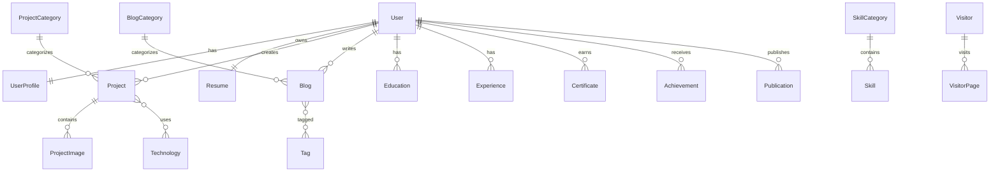

Dynamic Portfolio Website
Entity Relationship (ER) Diagram Document
Project Name : Dynamic Portfolio Website
Version      : 1.0.0
Document Type: Entity Relationship Diagram (ERD)
Framework    : Django
Database     : PostgreSQL
Author       : Mahammad Sinan
Status       : Planning Phase
1. Introduction
Overview

The Entity Relationship Diagram (ERD) represents the logical structure of the Dynamic Portfolio Website database. It illustrates the entities, their attributes, primary keys, foreign keys, and the relationships between them.

The ERD acts as the blueprint for implementing Django models and PostgreSQL tables. It ensures consistency across the application and provides a clear understanding of how data flows between different modules.

The design follows relational database principles and supports scalability, maintainability, and efficient querying.

2. Purpose

The purpose of this document is to:

Define all entities in the system.
Describe relationships between entities.
Identify primary and foreign keys.
Visualize database structure.
Support Django model implementation.
Assist in API and admin panel development.
Ensure database normalization and integrity.
Provide a reference for future maintenance and expansion.
3. ER Diagram Overview

The database is organized into functional domains:

Authentication
User
UserProfile
SocialLink
Resume
Portfolio
SkillCategory
Skill
Technology
ProjectCategory
Project
ProjectImage
Career
Education
Experience
Certificate
Achievement
Publication
Blog
BlogCategory
Tag
Blog
Communication
ContactMessage
Subscriber
Testimonial
Analytics
Visitor
VisitorPage
Administration
SiteSetting

Each entity has a clearly defined responsibility and communicates with related entities through well-defined relationships.

4. Database Design Rules

The database follows these design principles:

Third Normal Form (3NF)
One responsibility per table
No duplicate data
Foreign key enforcement
Atomic columns
Meaningful naming conventions
Soft deletion where appropriate
Automatic timestamps (created_at, updated_at)
Audit-friendly structure
Scalable and modular design
5. Entity List
Authentication
Entity	Purpose
User	Authentication
UserProfile	Personal information
SocialLink	Social media accounts
Resume	Resume file management
Portfolio
Entity	Purpose
SkillCategory	Groups skills
Skill	Technical skills
Technology	Technologies used
ProjectCategory	Project categories
Project	Portfolio projects
ProjectImage	Project gallery
Career
Entity	Purpose
Education	Academic history
Experience	Work experience
Certificate	Certifications
Achievement	Awards and accomplishments
Publication	Research papers
Blog
Entity	Purpose
BlogCategory	Blog categories
Blog	Articles
Tag	Blog tags
Communication
Entity	Purpose
ContactMessage	Contact form
Subscriber	Newsletter
Testimonial	User testimonials
Analytics
Entity	Purpose
Visitor	Visitor session
VisitorPage	Page visits
Administration
Entity	Purpose
SiteSetting	Website configuration
6. Entity Attributes

Each entity contains:

Primary Key
id (BigAutoField)
Audit Fields
created_at
updated_at
Status Fields
is_active
Optional Fields
slug
image
description

Example:

Project
id
title
slug
short_description
description
github_url
live_demo_url
featured
status
created_at
updated_at
7. Relationship Types

The system uses three relationship types.

One-to-One

Example:

User
   │
   │
UserProfile
One-to-Many

Example:

ProjectCategory

│

├── Project

├── Project

└── Project
Many-to-Many

Example:

Project

│

├──────── Technology

├──────── Technology

└──────── Technology
8. Cardinality
Relationship	Cardinality
User → Profile	1 : 1
User → Resume	1 : 1
User → Project	1 : N
User → Blog	1 : N
ProjectCategory → Project	1 : N
BlogCategory → Blog	1 : N
Project ↔ Technology	M : N
Blog ↔ Tag	M : N
Visitor → VisitorPage	1 : N
9. Primary Keys

Every entity uses:

id (BigAutoField)

Advantages:

Unique identification
Efficient indexing
Django default support
Better scalability
10. Foreign Keys

Examples:

Child Table	Parent Table
UserProfile	User
Resume	User
Project	User
Project	ProjectCategory
ProjectImage	Project
Blog	BlogCategory
Blog	User
Certificate	User
Experience	User
Education	User
VisitorPage	Visitor

Foreign keys enforce referential integrity and simplify ORM relationships.

11. Many-to-Many Tables

The application includes the following many-to-many relationships:

Relationship	Junction Table
Project ↔ Technology	project_technology
Blog ↔ Tag	blog_tag

Django will typically manage these through implicit or explicit intermediary tables.

12. Relationship Description
User

Owns:

Profile
Resume
Projects
Skills
Blogs
Certificates
Education
Experience
Achievements
Publications
Project

Belongs to:

User
ProjectCategory

Contains:

Multiple Images
Multiple Technologies
Blog

Belongs to:

User
BlogCategory

Contains:

Multiple Tags
Visitor

Contains:

Multiple Page Visits
13. Mermaid ER Diagram

14. Visual ER Diagram

Store visual diagrams in:

docs/diagrams/

er_diagram.png
er_diagram.svg
er_diagram.drawio
er_diagram.mmd

The visual ER diagram should include:

Entity names
Attributes
Primary keys
Foreign keys
Relationship names
Cardinality
Optionality (where relevant)

This diagram can be created using Draw.io, Lucidchart, dbdiagram.io, or Mermaid.

15. Normalization Summary

The database follows:

First Normal Form (1NF)
Atomic attributes
No repeating groups
Second Normal Form (2NF)
Full dependency on primary keys
Third Normal Form (3NF)
No transitive dependencies
Benefits
Reduced redundancy
Better consistency
Easier maintenance
Improved scalability
16. Future Expansion

The ER model has been designed to support future features without major structural changes.

Possible additions include:

User authentication for visitors
Portfolio themes
Comments and replies
Likes and reactions
Notifications
Team collaboration
Job applications
AI chatbot
Resume builder
Multi-language support
Portfolio analytics dashboard
Audit logs

These features can be integrated by adding new entities and relationships while preserving the existing schema.

17. Conclusion

The Entity Relationship Diagram provides a complete logical representation of the Dynamic Portfolio Website database. It defines the entities, attributes, keys, relationships, and cardinality required to implement the application using Django and PostgreSQL. This document serves as the foundation for creating Django models, migrations, REST APIs, forms, and the administration panel while ensuring a scalable, normalized, and maintainable database design.

